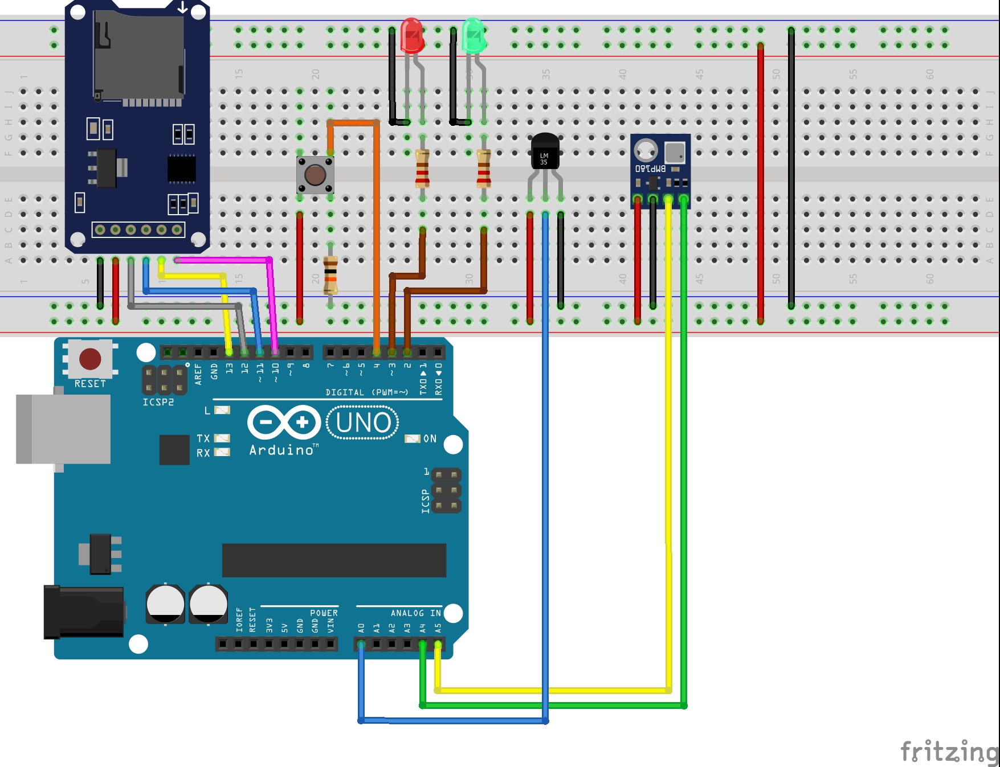
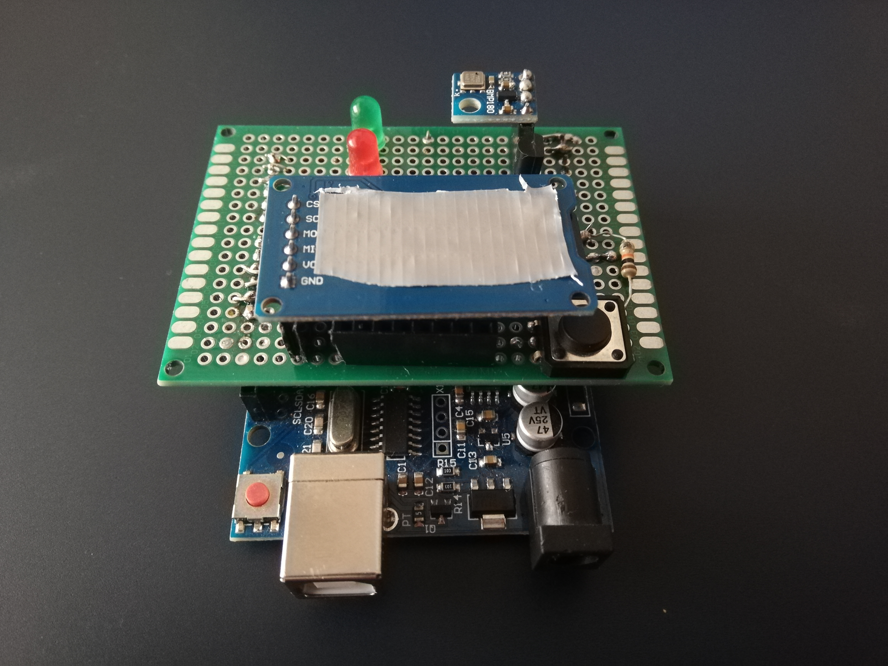

# arduino-datalogger
For logging data to SD card
This repository was created to support another project I am currently working on. The circuit diagram is shown in the picture. I made a compact shield as shown in the picture to work comfortably.

